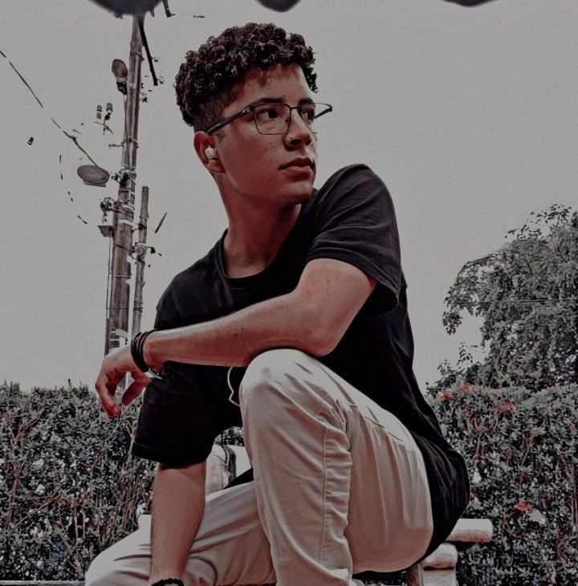
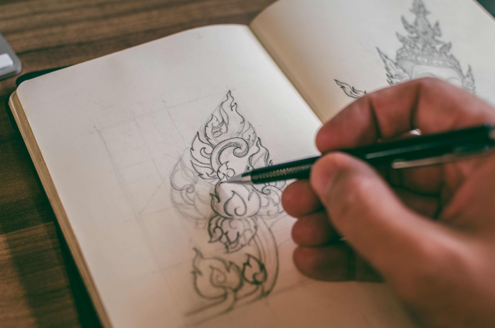

  <!-- Fondo en capa separada con opacidad al 50% -->
  
  <!-- Centrar la foto de perfil horizontalmente y bajarla un poco fuera del fondo -->
  

    
  

<header style="margin-top: 30px;text-align:center">
<h1>Frontend Developer ⚡</h1>
</header>

  
  
  
  
  
  
  
  
  
  

---

<section style="display:flex; flex-wrap:wrap; align-items:stretch; gap:16px;">
  

    
  

  

    <header>
      <h2>Hola, ¿cómo estás? 👋</h2>
    </header>
    

      Bienvenido/a — espero que encuentres todo lo que buscas en este perfil. Soy autodidacta y estoy en constante evolución, mejorando mis habilidades y creando proyectos que combinan desarrollo web y creatividad visual.
    

    

      Si necesitas ayuda o quieres colaborar en algún proyecto, con gusto puedo atenderte. ¡Hablemos!
    

  

</section>

<section style="display:flex; flex-wrap:wrap; align-items:stretch; gap:16px; margin-top: 20px">
  
  

    <header>
      <h2>Pasatiempos 🍃</h2>
    </header>
    

      Aparte de mi entorno laboral, cuento con un conjunto de actividades que complementan mis habilidades como desarrollador y diseñador.
    

    

      
- Dibujar 🎨

      
- Tatuar 🖋️

      
- Gym 🏋️‍♂️

      
- Viajar ✈️

      
- Videojuegos 🎮

    

  

  

    
  

</section>

---

## 📫 Contactos

📍 Montería, Colombia  
📧 snaiderortega10@gmail.com  
💼 [LinkedIn](https://www.linkedin.com/in/esnaideror/)  
🌐 [Portafolio Web](https://darkin03.github.io/Esnaider.OR/)  
📄 [Descargar CV](./CV.pdf)

